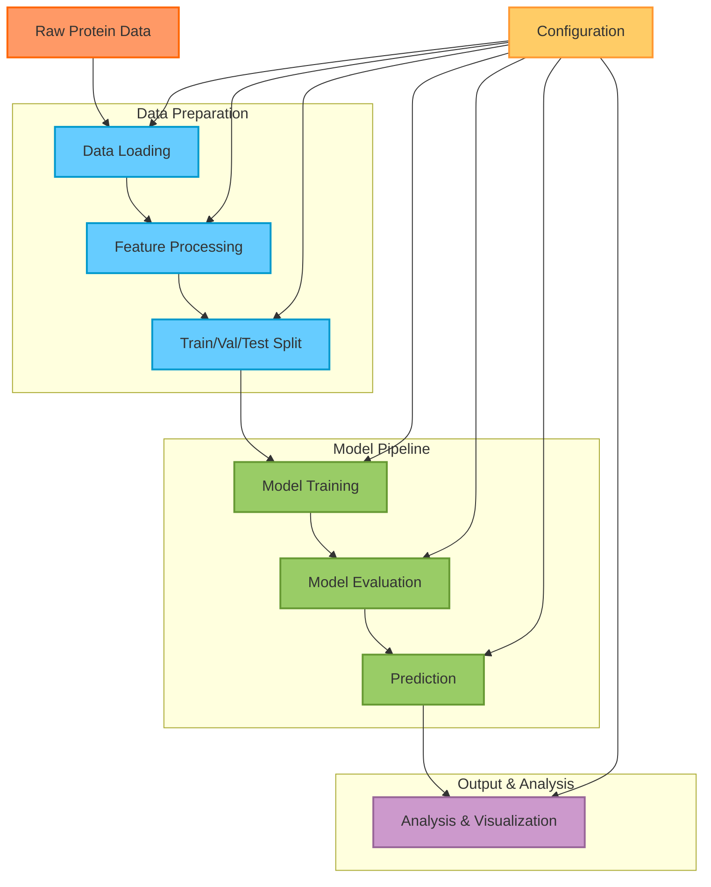

# FlexSeq: Protein Flexibility Prediction Pipeline 🧬🔍

<div align="center">


[](https://www.python.org/)
[](LICENSE)
[](CONTRIBUTING.md)

**A comprehensive machine learning pipeline for predicting protein flexibility (RMSF) across multiple temperatures**

[📊 Key Features](#key-features) •
[🔧 Installation](#installation) •
[🚀 Quick Start](#quick-start) •
[🔄 Pipeline Overview](#pipeline-overview) •
[📥 Input Data](#input-data) •
[📤 Output Data](#output-data) •
[📈 Visualizations](#visualizations) •
[📚 Documentation](#documentation) •
[🤝 Contributing](#contributing)

</div>

## 🌟 Overview

FlexSeq is a machine learning pipeline for predicting protein flexibility (Root Mean Square Fluctuation, RMSF) from sequence and structural features. The pipeline supports analysis across multiple temperatures and offers two operational modes:

- **🔬 FlexSeq Mode**: Standard prediction using protein sequence and structural features
- **🔭 OmniFlex Mode**: Enhanced prediction incorporating ESM embeddings and 3D voxel representations

The pipeline employs a modular architecture with configurable models, extensive feature engineering, and comprehensive evaluation metrics, making it suitable for a wide range of protein flexibility analysis tasks.

## 📊 Key Features

<table>
<thead>
  <tr bgcolor="#6236FF">
    <th width="200"><span style="color:white">Feature</span></th>
    <th><span style="color:white">Description</span></th>
  </tr>
</thead>
<tbody>
  <tr>
    <td>🌡️ Multi-Temperature Analysis</td>
    <td>Predict and compare protein flexibility across different temperatures (320K-450K)</td>
  </tr>
  <tr>
    <td>🤖 Multiple ML Models</td>
    <td>Random Forest and Neural Network implementations with easy extensibility</td>
  </tr>
  <tr>
    <td>⚙️ Feature Engineering</td>
    <td>Automatic generation of window-based features and encoding of categorical variables</td>
  </tr>
  <tr>
    <td>🔬 Advanced Mode (OmniFlex)</td>
    <td>Integration with ESM embeddings and 3D voxel representations for improved accuracy</td>
  </tr>
  <tr>
    <td>⚠️ Uncertainty Quantification</td>
    <td>Models provide uncertainty estimates for predictions</td>
  </tr>
  <tr>
    <td>📏 Comprehensive Evaluation</td>
    <td>Multiple metrics including RMSE, MAE, R², and correlation coefficients</td>
  </tr>
  <tr>
    <td>📊 Visualizations</td>
    <td>Extensive visualization suite for model performance and protein analysis</td>
  </tr>
  <tr>
    <td>🔍 Detailed Analysis</td>
    <td>Residue-level, amino acid-specific, and domain-level analysis tools</td>
  </tr>
  <tr>
    <td>🎯 Hyperparameter Optimization</td>
    <td>Automated tuning via grid search, random search, or Bayesian optimization</td>
  </tr>
  <tr>
    <td>💻 Command-Line Interface</td>
    <td>Easy-to-use CLI for all pipeline operations</td>
  </tr>
</tbody>
</table>

## 🔄 Pipeline Overview

The FlexSeq pipeline follows a modular workflow designed for flexibility and extensibility:



### 🧩 Logical Flow of Operation

```mermaid
flowchart TB
    start([🏁 Start]) --> config[📝 Load Configuration]
    config --> mode{🔀 Select Mode}
    mode -->|FlexSeq| std[📊 Standard Features]
    mode -->|OmniFlex| adv[🔬 Advanced Features + ESM/Voxel]
    
    std --> temp[🌡️ Select Temperature]
    adv --> temp
    
    temp --> data[📥 Load & Process Data]
    data --> split[✂️ Split Data]
    split --> train_test{🔄 Operation?}
    
    train_test -->|Train| model_select[🤖 Select Models]
    model_select --> train[🏋️ Train Models]
    train --> hp{🎯 Optimize Hyperparameters?}
    hp -->|Yes| optimize[🔧 Hyperparameter Optimization]
    hp -->|No| eval
    optimize --> eval
    
    train_test -->|Evaluate| load_models[📂 Load Trained Models]
    load_models --> eval[📏 Evaluate Models]
    
    train_test -->|Predict| best_model[🥇 Select Best Model]
    best_model --> predict[🔮 Generate Predictions]
    predict --> output[💾 Save Predictions]
    
    eval --> metrics[📊 Calculate Metrics]
    metrics --> save_results[💾 Save Results]
    save_results --> analyze[🔍 Analyze Results]
    analyze --> visualize[📈 Generate Visualizations]
    visualize --> finish([🏁 Finish])
    
    style start fill:#f9f9f9,stroke:#333,stroke-width:2px
    style finish fill:#f9f9f9,stroke:#333,stroke-width:2px
    style config fill:#ffcc99,stroke:#ff9933,stroke-width:2px
    style mode fill:#ffcc99,stroke:#ff9933,stroke-width:2px
    style std fill:#ccffcc,stroke:#66cc66,stroke-width:2px
    style adv fill:#ccffcc,stroke:#66cc66,stroke-width:2px
    style temp fill:#ccffcc,stroke:#66cc66,stroke-width:2px
    style data fill:#ccffcc,stroke:#66cc66,stroke-width:2px
    style split fill:#ccffcc,stroke:#66cc66,stroke-width:2px
    style train_test fill:#99ccff,stroke:#3399ff,stroke-width:2px
    style model_select fill:#ffccff,stroke:#ff99ff,stroke-width:2px
    style train fill:#ffccff,stroke:#ff99ff,stroke-width:2px
    style hp fill:#ffccff,stroke:#ff99ff,stroke-width:2px
    style optimize fill:#ffccff,stroke:#ff99ff,stroke-width:2px
    style load_models fill:#ffccff,stroke:#ff99ff,stroke-width:2px
    style eval fill:#ffccff,stroke:#ff99ff,stroke-width:2px
    style best_model fill:#ffccff,stroke:#ff99ff,stroke-width:2px
    style predict fill:#ffccff,stroke:#ff99ff,stroke-width:2px
    style output fill:#ccffff,stroke:#66cccc,stroke-width:2px
    style metrics fill:#ccffff,stroke:#66cccc,stroke-width:2px
    style save_results fill:#ccffff,stroke:#66cccc,stroke-width:2px
    style analyze fill:#ccffff,stroke:#66cccc,stroke-width:2px
    style visualize fill:#ccffff,stroke:#66cccc,stroke-width:2px
```



## 🔧 Installation

### Prerequisites
- Python 3.8 or higher
- pip (Python package installer)

### Install from PyPI
```bash
pip install flexseq
```

### Install from Source
```bash
git clone https://github.com/Felixburton7/flexseq.git
cd flexseq
pip install -e .
```

## 🚀 Quick Start

### Basic Usage

```bash
# Train a model at a specific temperature
flexseq train --temperature 320

# Evaluate the model
flexseq evaluate --temperature 320

# Make predictions on new data
flexseq predict --input new_proteins.csv --temperature 320
```

### Advanced Usage

```bash
# Train using OmniFlex mode (with advanced features)
flexseq train --mode omniflex --temperature 320

# Train on all available temperatures
flexseq train-all-temps

# Run the complete pipeline (train, evaluate, analyze)
flexseq run --temperature 320 --model random_forest

# Compare results across temperatures
flexseq compare-temperatures
```

## 📥 Input Data

FlexSeq expects input data in CSV format with specific columns:

<table>
<thead>
  <tr bgcolor="#6236FF">
    <th><span style="color:white">Column</span></th>
    <th><span style="color:white">Description</span></th>
    <th><span style="color:white">Required</span></th>
    <th><span style="color:white">Example</span></th>
  </tr>
</thead>
<tbody>
  <tr>
    <td><code>domain_id</code></td>
    <td>Protein domain identifier</td>
    <td>✅ Yes</td>
    <td><code>1a0aA00</code></td>
  </tr>
  <tr>
    <td><code>resid</code></td>
    <td>Residue ID (position in chain)</td>
    <td>✅ Yes</td>
    <td><code>42</code></td>
  </tr>
  <tr>
    <td><code>resname</code></td>
    <td>Amino acid type</td>
    <td>✅ Yes</td>
    <td><code>ALA</code></td>
  </tr>
  <tr>
    <td><code>rmsf_{temperature}</code></td>
    <td>RMSF value at specified temperature</td>
    <td>✅ Yes (for training)</td>
    <td><code>0.835</code></td>
  </tr>
  <tr>
    <td><code>protein_size</code></td>
    <td>Total residues in protein</td>
    <td>❌ No</td>
    <td><code>153</code></td>
  </tr>
  <tr>
    <td><code>normalized_resid</code></td>
    <td>Position normalized to 0-1 range</td>
    <td>❌ No</td>
    <td><code>0.274</code></td>
  </tr>
  <tr>
    <td><code>core_exterior</code></td>
    <td>Location classification</td>
    <td>❌ No</td>
    <td><code>interior</code> or <code>surface</code></td>
  </tr>
  <tr>
    <td><code>relative_accessibility</code></td>
    <td>Solvent accessibility measure</td>
    <td>❌ No</td>
    <td><code>0.12</code></td>
  </tr>
  <tr>
    <td><code>dssp</code></td>
    <td>Secondary structure annotation</td>
    <td>❌ No</td>
    <td><code>H</code> (helix), <code>E</code> (sheet), <code>C</code> (coil)</td>
  </tr>
  <tr>
    <td><code>phi</code>, <code>psi</code></td>
    <td>Backbone dihedral angles</td>
    <td>❌ No</td>
    <td><code>-65.3</code>, <code>120.7</code></td>
  </tr>
</tbody>
</table>

### 🔬 OmniFlex Mode Additional Columns

<table>
<thead>
  <tr bgcolor="#9966CC">
    <th><span style="color:white">Column</span></th>
    <th><span style="color:white">Description</span></th>
    <th><span style="color:white">Required for OmniFlex</span></th>
  </tr>
</thead>
<tbody>
  <tr>
    <td><code>esm_rmsf</code></td>
    <td>Predictions from ESM embeddings</td>
    <td>✅ Yes</td>
  </tr>
  <tr>
    <td><code>voxel_rmsf</code></td>
    <td>Predictions from 3D voxel representation</td>
    <td>✅ Yes</td>
  </tr>
</tbody>
</table>

## 📤 Output Data

FlexSeq generates various output files organized in a structured directory hierarchy:

<table>
<thead>
  <tr bgcolor="#FF5733">
    <th><span style="color:white">Output</span></th>
    <th><span style="color:white">Description</span></th>
    <th><span style="color:white">Format</span></th>
    <th><span style="color:white">Path</span></th>
  </tr>
</thead>
<tbody>
  <tr>
    <td>💾 Trained Models</td>
    <td>Saved model files</td>
    <td>Pickle (.pkl)</td>
    <td><code>./models/models_{temperature}/{model_name}.pkl</code></td>
  </tr>
  <tr>
    <td>📊 Evaluation Results</td>
    <td>Performance metrics</td>
    <td>CSV</td>
    <td><code>./output/outputs_{temperature}/evaluation_results.csv</code></td>
  </tr>
  <tr>
    <td>🔮 Prediction Results</td>
    <td>Predicted RMSF values</td>
    <td>CSV</td>
    <td><code>./output/{input_base}_predictions_{temperature}.csv</code></td>
  </tr>
  <tr>
    <td>⭐ Feature Importance</td>
    <td>Model feature importance</td>
    <td>CSV</td>
    <td><code>./output/outputs_{temperature}/feature_importance/{model_name}_feature_importance.csv</code></td>
  </tr>
  <tr>
    <td>🧩 Domain Analysis</td>
    <td>Domain-level metrics</td>
    <td>CSV</td>
    <td><code>./output/outputs_{temperature}/domain_metrics.csv</code></td>
  </tr>
  <tr>
    <td>🔍 Residue Analysis</td>
    <td>Residue-level analysis</td>
    <td>CSV</td>
    <td><code>./output/outputs_{temperature}/residue_analysis/</code></td>
  </tr>
  <tr>
    <td>🌡️ Temperature Comparison</td>
    <td>Cross-temperature analysis</td>
    <td>CSV</td>
    <td><code>./output/outputs_comparison/</code></td>
  </tr>
  <tr>
    <td>📈 Visualization Data</td>
    <td>Data for external visualization</td>
    <td>CSV</td>
    <td><code>./output/outputs_{temperature}/visualization_data/</code></td>
  </tr>
</tbody>
</table>

## 🤖 Models

FlexSeq includes two primary model implementations with different strengths:

<table>
<thead>
  <tr bgcolor="#009688">
    <th><span style="color:white">Model</span></th>
    <th><span style="color:white">Description</span></th>
    <th><span style="color:white">Key Parameters</span></th>
    <th><span style="color:white">Uncertainty</span></th>
  </tr>
</thead>
<tbody>
  <tr>
    <td>🌲 Random Forest</td>
    <td>Ensemble of decision trees providing robust predictions with lower risk of overfitting</td>
    <td>
      • <code>n_estimators</code>: Number of trees<br>
      • <code>max_depth</code>: Maximum tree depth<br>
      • <code>max_features</code>: Feature subset size
    </td>
    <td>Variance across tree predictions</td>
  </tr>
  <tr>
    <td>🧠 Neural Network</td>
    <td>Feedforward neural network capable of learning complex non-linear relationships</td>
    <td>
      • <code>hidden_layers</code>: Layer sizes<br>
      • <code>activation</code>: Activation function<br>
      • <code>dropout</code>: Regularization rate<br>
      • <code>learning_rate</code>: Optimizer learning rate
    </td>
    <td>Monte Carlo dropout sampling</td>
  </tr>
</tbody>
</table>

## 📈 Visualizations

FlexSeq generates a comprehensive set of visualizations for model analysis and protein flexibility interpretation:

<table>
<thead>
  <tr bgcolor="#3F51B5">
    <th><span style="color:white">Visualization</span></th>
    <th><span style="color:white">Description</span></th>
    <th><span style="color:white">Format</span></th>
  </tr>
</thead>
<tbody>
  <tr>
    <td>📊 R² Comparison</td>
    <td>Comparison of R² scores across models</td>
    <td>PNG, CSV</td>
  </tr>
  <tr>
    <td>📏 Residue-level RMSF</td>
    <td>RMSF profiles along protein sequence</td>
    <td>PNG, CSV</td>
  </tr>
  <tr>
    <td>🧪 Amino Acid Error Analysis</td>
    <td>Error distribution by amino acid type</td>
    <td>PNG, CSV</td>
  </tr>
  <tr>
    <td>📦 Error Boxplots</td>
    <td>Error distribution boxplots by amino acid</td>
    <td>PNG, CSV</td>
  </tr>
  <tr>
    <td>🔄 Scatter Plots</td>
    <td>Predicted vs actual RMSF values</td>
    <td>PNG, CSV</td>
  </tr>
  <tr>
    <td>🌫️ Density Contour Plots</td>
    <td>Density-based visualization of predictions</td>
    <td>PNG, CSV</td>
  </tr>
  <tr>
    <td>⭐ Feature Importance</td>
    <td>Feature importance bar charts</td>
    <td>PNG, CSV</td>
  </tr>
  <tr>
    <td>🌡️ Temperature Comparison</td>
    <td>RMSF trends across temperatures</td>
    <td>PNG, CSV</td>
  </tr>
  <tr>
    <td>🔄 Dihedral Angle Analysis</td>
    <td>Flexibility in dihedral angle space</td>
    <td>PNG, CSV</td>
  </tr>
  <tr>
    <td>🧬 Secondary Structure Analysis</td>
    <td>RMSF by secondary structure type</td>
    <td>PNG, CSV</td>
  </tr>
  <tr>
    <td>🔥 Error Response Surface</td>
    <td>2D heatmap of error by position and structure</td>
    <td>PNG, CSV</td>
  </tr>
</tbody>
</table>

### 📊 Example Visualizations

<div align="center">

</div>

## ⚙️ Configuration

FlexSeq uses a YAML-based configuration system with support for overrides via environment variables and command-line parameters.

Key configuration sections include:

- **📁 Paths**: Data, output, and model directories
- **🔄 Mode**: FlexSeq or OmniFlex
- **🌡️ Temperature**: Current and available temperatures
- **📊 Dataset**: Data loading, filtering, and feature configuration
- **🤖 Models**: Model-specific parameters and hyperparameter optimization settings
- **📏 Evaluation**: Metrics and comparison settings
- **🔍 Analysis**: Visualization and analysis options

Example:

```yaml
# FlexSeq Configuration
paths:
  data_dir: ./data
  output_dir: ./output
  models_dir: ./models

mode:
  active: "flexseq"  # "flexseq" or "omniflex"
  omniflex:
    use_esm: true
    use_voxel: true

temperature:
  current: 320
  available: [320, 348, 379, 413, 450, "average"]

models:
  random_forest:
    enabled: true
    n_estimators: 100
    max_depth: null
    max_features: 0.7
```

## 💻 Command-Line Interface

FlexSeq provides a comprehensive CLI for all pipeline operations:

<table>
<thead>
  <tr bgcolor="#FF9800">
    <th><span style="color:white">Command</span></th>
    <th><span style="color:white">Description</span></th>
    <th><span style="color:white">Example</span></th>
  </tr>
</thead>
<tbody>
  <tr>
    <td>🏋️ <code>train</code></td>
    <td>Train flexibility prediction models</td>
    <td><code>flexseq train --temperature 320</code></td>
  </tr>
  <tr>
    <td>📏 <code>evaluate</code></td>
    <td>Evaluate trained models</td>
    <td><code>flexseq evaluate --model random_forest</code></td>
  </tr>
  <tr>
    <td>🔮 <code>predict</code></td>
    <td>Generate predictions for new data</td>
    <td><code>flexseq predict --input new_proteins.csv</code></td>
  </tr>
  <tr>
    <td>🌡️ <code>train-all-temps</code></td>
    <td>Train models on all available temperatures</td>
    <td><code>flexseq train-all-temps</code></td>
  </tr>
  <tr>
    <td>📊 <code>compare-temperatures</code></td>
    <td>Compare results across temperatures</td>
    <td><code>flexseq compare-temperatures</code></td>
  </tr>
  <tr>
    <td>🔧 <code>preprocess</code></td>
    <td>Preprocess data without training</td>
    <td><code>flexseq preprocess --input raw_data.csv</code></td>
  </tr>
  <tr>
    <td>🚀 <code>run</code></td>
    <td>Run the complete pipeline</td>
    <td><code>flexseq run --mode omniflex</code></td>
  </tr>
  <tr>
    <td>📋 <code>list-models</code></td>
    <td>List available models</td>
    <td><code>flexseq list-models</code></td>
  </tr>
  <tr>
    <td>📋 <code>list-temperatures</code></td>
    <td>List available temperatures</td>
    <td><code>flexseq list-temperatures</code></td>
  </tr>
</tbody>
</table>

## 📚 Documentation

For complete documentation, visit the [FlexSeq Documentation](https://flexseq.readthedocs.io/).

- 📥 [Installation Guide](https://flexseq.readthedocs.io/en/latest/installation.html)
- 📖 [User Guide](https://flexseq.readthedocs.io/en/latest/user_guide.html)
- 🔍 [API Reference](https://flexseq.readthedocs.io/en/latest/api.html)
- 💡 [Examples](https://flexseq.readthedocs.io/en/latest/examples.html)
- 🤝 [Contributing](https://flexseq.readthedocs.io/en/latest/contributing.html)

## 📝 Citation

If you use FlexSeq in your research, please cite:

```bibtex
@software{burton2023flexseq,
  author = {Burton, Felix},
  title = {FlexSeq: Protein Flexibility Prediction Pipeline},
  year = {2023},
  url = {https://github.com/Felixburton7/flexseq}
}
```

## 🤝 Contributing

Contributions are welcome! Please check out our [contribution guidelines](CONTRIBUTING.md) for details on how to get started.

## 📄 License

This project is licensed under the MIT License - see the [LICENSE](LICENSE) file for details.

## 👏 Acknowledgements

- 🧪 This project was developed by Felix Burton ([@Felixburton7](https://github.com/Felixburton7))
- 🙏 Special thanks to contributors and the computational biology community
